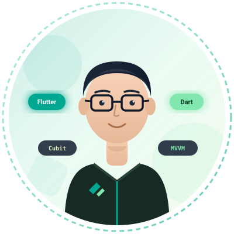

# Mohamed Zakaria — Personal Portfolio Website

A production-grade, responsive, and accessible personal portfolio website built with **semantic HTML5, modern vanilla CSS3, and vanilla JavaScript**.

Designed specifically for **Mohamed Zakaria**, a Junior Flutter Developer and Computer & Systems Engineering student at Zagazig University, emphasizing Clean Architecture, MVVM, Cubit state management, mobile UI development, and RESTful / Firebase cloud integrations.

---

## 🚀 Live Demo & Preview

* **Local Dev Server:** `http://localhost:8000` (or VS Code Live Server)
* **Design Identity:** Calm, modern, minimal, engineering-driven, with dual Light & Dark themes.

---

## 📁 Project Structure

```text
portfolio/
│
├── index.html                   # Semantic HTML5 markup with complete SEO & accessibility
├── styles.css                   # Modular CSS3 design system with CSS custom properties & media queries
├── script.js                    # Modular Vanilla JS (Theme, Carousel, Modals, Validation, Customization)
│
├── assets/
│   ├── images/
│   │   ├── profile-avatar.svg   # High-resolution vector portrait illustration
│   │   ├── about-visual.svg     # Clean Architecture layers diagram (Flutter UI / Domain / Data)
│   │   ├── project-news.svg     # News App mobile UI mockup (MVVM, Cubit, REST API)
│   │   ├── project-ecommerce.svg# E-Commerce App mobile UI mockup (Firebase Auth, Firestore)
│   │   └── project-todo.svg     # To-Do App mobile UI mockup (SQLite, Cubit)
│   │
│   ├── icons/                   # Directory reserved for custom SVG/favicon assets
│   │
│   └── cv/
│       └── Mohamed-Zakaria-CV.pdf # Standard PDF resume linked to "Hire Me" & "Download CV" buttons
│
└── README.md                    # Complete setup, customization, and deployment manual
```

---

## 🛠️ How to Run Locally

You do not need to install any heavy Node.js frameworks or build steps. Any static web server can serve this project.

### Option 1: Python 3 (Pre-installed)
From the portfolio directory, run:
```bash
python -m http.server 8000
```
Then open [http://localhost:8000](http://localhost:8000) in your browser.

### Option 2: Node.js / npx serve
```bash
npx -y serve .
```

### Option 3: VS Code "Live Server" Extension
1. Open the project folder in VS Code.
2. Right-click `index.html` and choose **"Open with Live Server"**.

---

## 🎨 How to Customize Content

All content has been architected for effortless editing in two places:
1. `script.js` (Centralized `portfolioData` object at the very top)
2. `index.html` (Static semantic tags and links)

### 1. Change Personal Information, Bio & Social Links
Open `script.js` and locate the `portfolioData.personal` object:
```javascript
const portfolioData = {
  personal: {
    name: "Mohamed Zakaria",
    primaryRole: "Flutter Developer",
    roles: [
      "Flutter Developer",
      "Software Engineer",
      "Mobile App Developer"
    ],
    education: {
      degree: "Computer and Systems Engineering",
      institution: "Zagazig University",
      grade: "Very Good"
    },
    cvPath: "assets/cv/Mohamed-Zakaria-CV.pdf",
    email: "YOUR_EMAIL@gmail.com",           // Replace with your real Gmail address
    whatsapp: "YOUR_WHATSAPP_NUMBER",         // Replace with your phone number (e.g. 201012345678)
    github: "https://github.com/YOUR_GITHUB_USERNAME",
    linkedin: "https://linkedin.com/in/YOUR_LINKEDIN_USERNAME"
  },
  // ...
};
```
In `index.html`, replace all occurrences of `YOUR_EMAIL@gmail.com`, `YOUR_WHATSAPP_NUMBER`, `YOUR_GITHUB_USERNAME`, and `YOUR_LINKEDIN_USERNAME` with your real contact handles and links.

### 2. Replace the Profile Photo
* **Place your real photo** in `assets/images/` (e.g., `assets/images/profile.jpg` or `assets/images/profile.png`).
* In `index.html`, locate line 192 (inside `#home`):
  ```html
  
  ```
  Change `src` to `assets/images/profile.jpg`.
* The CSS automatically crops your photo into a responsive circular frame with an accent gradient border and subtle glow.

### 3. Replace Project Screenshots
* Place your real Flutter app screenshots into `assets/images/`.
* In `index.html`, locate each project card under `#projects` and update the `src` attribute of `.project-thumb-img`.
* In `script.js`, update the `image` field inside `portfolioData.projects[projectId]` so the interactive modal displays your actual screenshots.

### 4. Replace or Update Your CV
* Keep your official resume named `Mohamed-Zakaria-CV.pdf` and place it in `assets/cv/Mohamed-Zakaria-CV.pdf`.
* The **"Hire Me"** and **"Download CV"** buttons throughout the header, hero, and contact sections link directly to this file with the `download` attribute.

### 5. Customize Skills & Progress Percentages
In `script.js`, adjust the `skills.technical` and `skills.nonTechnical` arrays:
```javascript
skills: {
  technical: [
    { name: "Flutter", level: 90 },
    { name: "Dart", level: 90 },
    { name: "REST APIs", level: 85 },
    // Add new skill or change level (0-100)
  ]
}
```
The skills section automatically re-renders the bars, labels, and percentage badges.

---

## 🎨 How to Customize Theme Colors

The color palette is managed via CSS variables in `styles.css`.

### Light Theme Colors:
```css
:root {
  --primary: #03A791;         /* Primary Emerald/Teal brand color */
  --secondary: #81E7AF;       /* Mint Green secondary accent */
  --accent: #E9F5BE;          /* Soft lime/cream accent surface */
  --bg-body: #F9FAF7;         /* Clean background */
  --text-main: #14201A;       /* High-contrast accessible text */
}
```

### Dark Theme Colors:
```css
[data-theme="dark"] {
  --primary: #1F7D53;         /* Deep emerald */
  --secondary: #255F38;       /* Forest green */
  --accent: #27391C;          /* Deep olive surface */
  --bg-body: #192514;         /* Rich dark body surface */
  --text-main: #F3F7F2;       /* High-contrast crisp text */
}
```

---

## 🚢 Deployment Guide

### 1. GitHub Pages (Free & Recommended)
1. Initialize git in this directory (if not already initialized):
   ```bash
   git init
   git add .
   git commit -m "feat: complete personal portfolio for Mohamed Zakaria"
   ```
2. Create a new repository on GitHub named `portfolio` (or `<your-username>.github.io`).
3. Link your remote repository and push:
   ```bash
   git remote add origin https://github.com/YOUR_GITHUB_USERNAME/portfolio.git
   git branch -M main
   git push -u origin main
   ```
4. On GitHub, go to **Settings** → **Pages**.
5. Under **Branch**, select `main` branch and `/ (root)` folder, then click **Save**.
6. Your portfolio will be live at `https://YOUR_GITHUB_USERNAME.github.io/portfolio/` within minutes!

### 2. Netlify
1. Log into [Netlify](https://www.netlify.com).
2. Click **"Add new site"** → **"Deploy manually"**.
3. Drag and drop the entire `Portfolio` folder into the Netlify upload box.
4. Your site is deployed immediately with a free HTTPS custom subdomain.

### 3. Vercel
1. Install Vercel CLI:
   ```bash
   npx vercel
   ```
2. Follow the prompt (defaults are fine; no build command required).

---

## ♿ Accessibility & Performance Standards

* **Semantic Landmarks:** Uses `<header>`, `<nav>`, `<main>`, `<section>`, `<article>`, `<dialog>`, and `<footer>`.
* **Reduced Motion:** Fully conforms to `prefers-reduced-motion: reduce`. Animations and cursor effects are gracefully disabled for users who prefer minimal motion.
* **Keyboard Friendly:** Full tab order navigation with distinct `:focus-visible` rings, dialog escape handling, and ARIA roles (`tablist`, `tab`, `region`, `aria-expanded`).
* **Zero Dependencies:** Pure vanilla code for ultra-fast First Contentful Paint (FCP) and optimal SEO score.

---

## 📄 License & Credits

Designed and architected for **Mohamed Zakaria**. All rights reserved &copy; 2026.
Feel free to use and adapt this portfolio template for personal developer branding.
